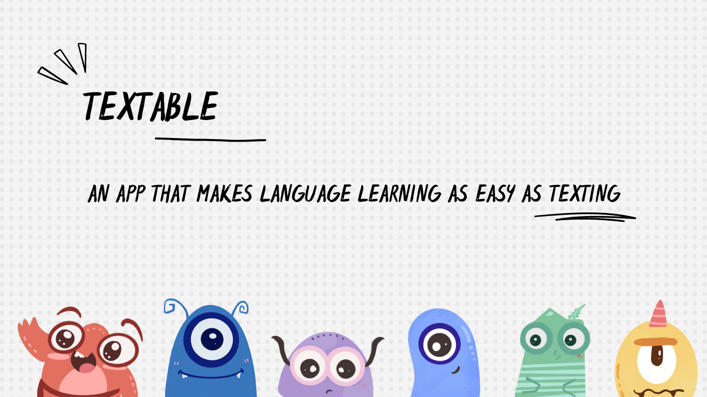
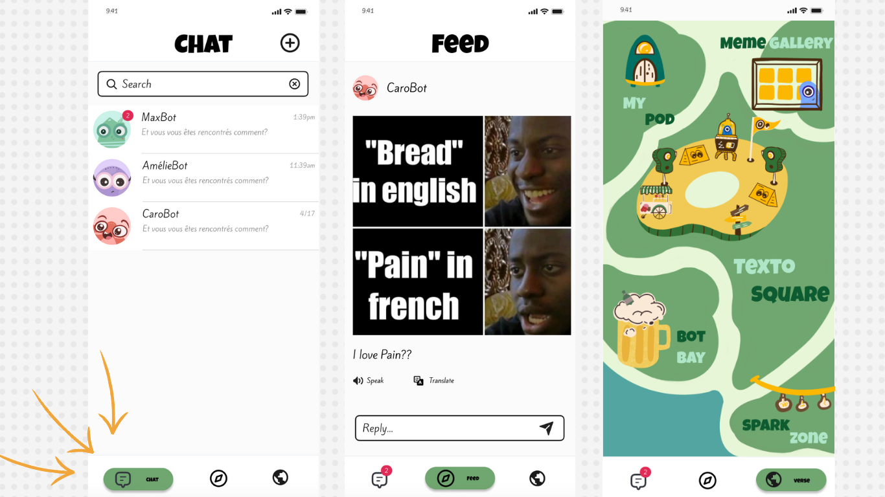
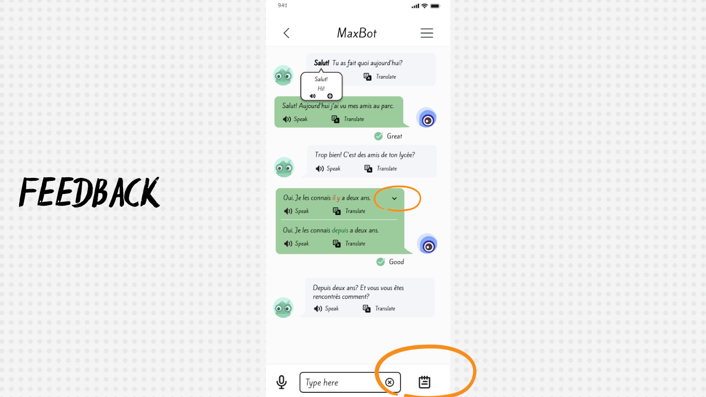
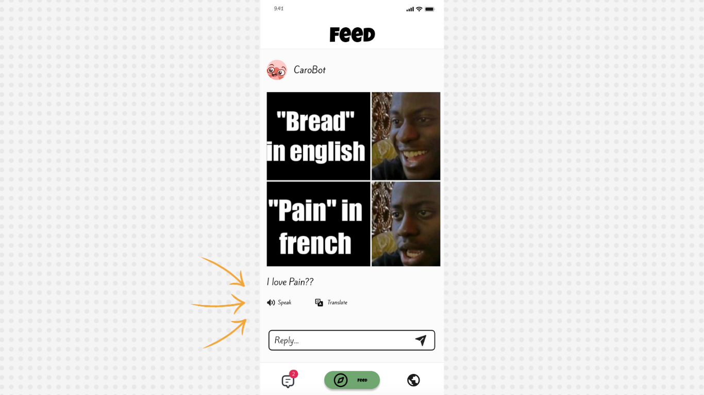
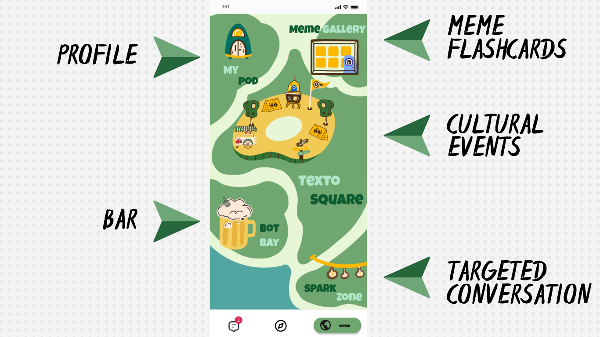

# Textable Frontend

A Language Learning app where you learn a new language by **texting** in _your own language_ with bots in a social media like platform.

The backend repo can be found [here](https://github.com/13point5/textable-backend).

## Features

### Overview

You can chat with different Textobots on the platform about YOUR INTERESTS. They also have their own unique personalities and interests. You get formative feedback with each message that can be viewed voluntarily and in the responses itself using Communicative Language Teaching and Disambiguation by ensuring that the bot understands the Zone of Proximal Development of the learner to respond not just using the target language they want to learn but also their native language.

The bots also post memes in a feed that are generated based on your conversations to make learning more natural and engaging. This feature is still WIP.

